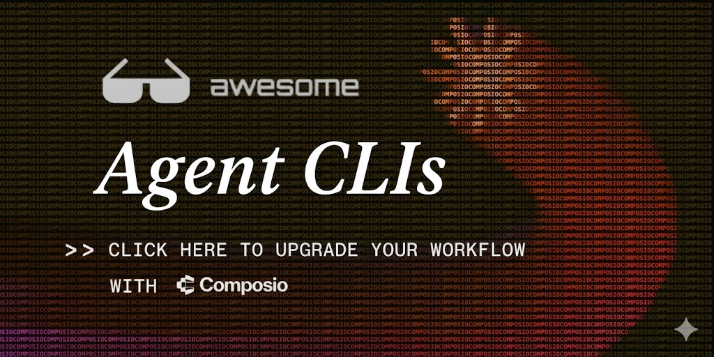

<h1 align="center">Awesome Agent CLIs</h1>

<p align="center">
<a href="https://platform.composio.dev/?utm_source=Github&utm_content=AwesomeAgentCLIs">
  
</a>
</p>

<p align="center">
  <a href="https://awesome.re">
    
  </a>
  <a href="https://makeapullrequest.com">
    
  </a>
  <a href="https://creativecommons.org/publicdomain/zero/1.0/">
    
  </a>
</p>

<p align="center">A curated list of CLIs built for humans and AI agents.</p>

<div>
<p align="center">
  <a href="https://twitter.com/composio">
    
  </a>
  <a href="https://www.linkedin.com/company/composiohq/">
    
  </a>
  <a href="https://discord.com/invite/composio">
    
  </a>
</p>
</div>

---

## Quickstart: Give Your Agent 1000+ Tools

The Composio CLI lets agents search, authenticate, and execute tools across 1000+ apps from the terminal.

```bash
curl -fsSL https://composio.dev/install | bash
composio login
composio search "star a github repo"
composio execute GITHUB_STAR_A_REPOSITORY_FOR_THE_AUTHENTICATED_USER -d '{"owner":"composiohq","repo":"composio"}'
```

Get your API key at [platform.composio.dev](https://platform.composio.dev/?utm_source=Github&utm_content=AwesomeAgentCLIs)

---

## What Makes a CLI Agent-Ready?

Not every CLI is built with agents in mind. The 🤖 badge marks CLIs that were **explicitly designed** for AI agent use. Common traits:

| Trait                                              | Why it matters                                |
| -------------------------------------------------- | --------------------------------------------- |
| Structured output (`--json`)                       | Agents parse JSON, not ASCII tables           |
| Non-interactive mode (`--no-interactive`, `--yes`) | Agents can't answer prompts                   |
| API key auth (`--key`, env vars)                   | No browser OAuth dance                        |
| Idempotency keys                                   | Agents can safely retry on failure            |
| Piped output detection                             | Auto-switches from pretty to machine-readable |
| Meaningful exit codes                              | Agents need to branch on success/failure      |

CLIs without the 🤖 badge are **established tools that work well with agents** thanks to structured output, scriptability, or good defaults.

---

## Contents

- [Quickstart](#quickstart-give-your-agent-1000-tools)
- [What Makes a CLI Agent-Ready?](#what-makes-a-cli-agent-ready)
- [CLIs](#clis)
  - [Coding & Development](#coding--development)
  - [Tool Orchestration](#tool-orchestration)
  - [Service Provisioning](#service-provisioning)
  - [Communication](#communication)
  - [Payments & Commerce](#payments--commerce)
  - [Cloud & Infrastructure](#cloud--infrastructure)
  - [Version Control](#version-control)
  - [Database](#database)
  - [Analytics & Observability](#analytics--observability)
  - [Workspace & Productivity](#workspace--productivity)
  - [Voice & Media](#voice--media)
- [Contributing](#contributing)
- [Resources](#resources)
- [License](#license)

## CLIs

### Coding & Development

- [Claude Code](https://docs.anthropic.com/en/docs/claude-code) 🤖 - Anthropic's terminal-native coding agent. Full codebase understanding, autonomous multi-step execution, and git-aware workflows.
- [Cursor CLI](https://cursor.com/docs/cli/overview) 🤖 - Cursor's terminal agent for writing, reviewing, and modifying code. Supports interactive, plan, and ask modes, plus non-interactive automation, session resume, cloud handoff, and sandbox controls.
- [Gemini CLI](https://github.com/google-gemini/gemini-cli) 🤖 - Google's open-source coding agent with Plan Mode, Conductor for automated reviews, and multimodal input.
- [OpenAI Codex CLI](https://github.com/openai/codex) 🤖 - OpenAI's terminal coding agent with sandboxed execution and multi-file editing.
- [Aider](https://github.com/Aider-AI/aider) - Git-native AI pair programming in the terminal. Works with any LLM, strong at refactors. _By [@paul-gauthier](https://github.com/paul-gauthier)_
- [OpenCode](https://github.com/opencode-ai/opencode) - Provider-agnostic AI coding CLI with multi-agent orchestration, Git-backed sessions, and TUI. _By [@opencode-ai](https://github.com/opencode-ai)_
- [Junie CLI](https://www.jetbrains.com/junie/) 🤖 - JetBrains' standalone coding agent. LLM-agnostic, runs in terminal/CI/CD, supports multiple models.
- [.NET Aspire CLI](https://learn.microsoft.com/en-us/dotnet/aspire/) 🤖 - Microsoft's AI-agent-native CLI for .NET with detached startup, resource control, and isolated environments.

### Tool Orchestration

- [Composio CLI](https://docs.composio.dev/docs/cli) 🤖 - Search, authenticate, and execute tools across 1000+ apps. Type-safe code generation, trigger listeners, and structured JSON output.

### Service Provisioning

- [Stripe Projects CLI](https://docs.stripe.com/projects) 🤖 - Provision provider-backed services from the terminal, link existing accounts, sync credentials into `.env`, and manage upgrades and billing. Supports agents with `--json`, `--no-interactive`, and `--auto-confirm`. Public preview.
- [Ramp CLI](https://ramp.com) 🤖 - Agent-ready spend and finance service provisioning.

### Communication

- [Resend CLI](https://github.com/resend/resend-cli) 🤖 - Send emails, manage domains, API keys, contacts, and broadcasts. 53 commands across 13 resources. Auto-detects TTY for JSON output, natural language scheduling, idempotency keys, `resend doctor` for agent detection. _By [@zenorocha](https://github.com/zenorocha)_
- [Sendblue CLI](https://sendblue.co) 🤖 - iMessage integration for agents.
- [Kapso CLI](https://kapso.ai) 🤖 - WhatsApp messaging from the terminal.
- [Mailcoach CLI](https://mailcoach.app) 🤖 - Email campaigns and transactional email management.

### Payments & Commerce

- [Stripe CLI](https://github.com/stripe/stripe-cli) - Test webhooks, trigger events, tail API logs, and manage Stripe resources. `--json` flag for structured output.
- [Visa CLI](https://visa.com) 🤖 - AI agents make card-native payments programmatically. Closed beta.

### Cloud & Infrastructure

- [Vercel CLI](https://github.com/vercel/vercel) - Deploy projects, manage domains and env vars, inspect logs, and sync local project settings with `vercel pull`. Supports token-based auth for CI with `--token`.
- [Railway CLI](https://github.com/railwayapp/cli) - Deploy services, manage variables, and provision databases from the terminal.
- [AWS CLI](https://github.com/aws/aws-cli) - Manage AWS services. `--output json` for structured output, profile-based auth.
- [Google Cloud CLI](https://cloud.google.com/sdk/gcloud) - Manage GCP resources. `--format=json`, service account auth, scriptable.

### Version Control

- [GitHub CLI](https://github.com/cli/cli) - Issues, PRs, repos, actions, and code search. `--json` with `--jq` for precise field extraction.
- [GitLab CLI](https://gitlab.com/gitlab-org/cli) - MRs, issues, pipelines, and CI/CD management. `--output json` flag.

### Database

- [Supabase CLI](https://github.com/supabase/cli) - Manage Postgres databases, auth, edge functions, and storage. Local dev with `supabase start`.
- [Neon CLI](https://neon.com/docs/reference/neon-cli) - Manage Neon projects, branches, databases, roles, and connection strings from the terminal. Supports web auth or API-key auth and structured output formats.
- [PlanetScale CLI](https://github.com/planetscale/cli) - Branch, deploy, and manage MySQL databases with deploy requests.
- [Turso CLI](https://github.com/tursodatabase/turso-cli) - Manage libSQL/SQLite databases, replicas, and groups.

### Analytics & Observability

- [PostHog CLI](https://posthog.com) - Query events, manage feature flags, and pull analytics data.
- [Sentry CLI](https://github.com/getsentry/sentry-cli) - Manage releases, upload source maps, and query issues. JSON output with `--format json`.

### Workspace & Productivity

- [Google Workspace CLI (`gws`)](https://github.com/googleworkspace/cli) 🤖 - One CLI for all of Google Workspace. Dynamically built from Google's Discovery Service — when Google adds an API endpoint, `gws` picks it up automatically. Drive, Gmail, Calendar, Sheets, Docs, Chat, Admin, and more. 100+ agent skills included, structured JSON output, structured exit codes (0–5), helper commands (`+send`, `+agenda`, `+triage`), and Model Armor response sanitization. 22k+ stars.

### Voice & Media

- [ElevenLabs CLI](https://elevenlabs.io) 🤖 - Voice and audio service management from the terminal.

## Contributing

Found a CLI that should be here? Open a PR!

1. Fork this repo
2. Add the CLI to the appropriate category
3. Use the format: `- [Name](link) - One-line description.`
4. Add 🤖 if the CLI was explicitly built with agent use in mind
5. Submit a PR

The CLI should be:

- **Publicly available** (GA or public beta)
- **Documented** with a working README or docs site
- **Useful from a terminal** (not just a wrapper around a GUI)

## Resources

- ["Building CLIs for agents" by @ericzakariasson](https://x.com/ericzakariasson/status/2036762680401223946) - 384K-view thread on what makes CLIs work for agents: non-interactive flags, useful `--help` with examples, idempotent commands, `--dry-run`, actionable errors, and pipeable output
- [Resend CLI announcement](https://resend.com/blog/resend-cli) - "Built for humans and AI agents"
- [Stripe Projects announcement](https://stripe.com/blog/introducing-stripe-projects) - "Provision and manage services from the CLI"
- [Composio CLI docs](https://docs.composio.dev/docs/cli) - Search and execute tools across 1000+ apps
- [Awesome Claude Skills](https://github.com/composio/awesome-claude-skills) - Curated Claude skills
- [Awesome OpenClaw Plugins](https://github.com/composio/awesome-openclaw-plugins) - Community-built OpenClaw plugins

## Join the Community

- [Join our Discord](https://discord.com/invite/composio) - Chat with other developers building agent workflows
- [Follow on Twitter/X](https://x.com/composio) - Stay updated on new CLIs and agent tooling
- Questions? [support@composio.dev](mailto:support@composio.dev)

## License

[CC0 1.0 Universal](https://creativecommons.org/publicdomain/zero/1.0/)
